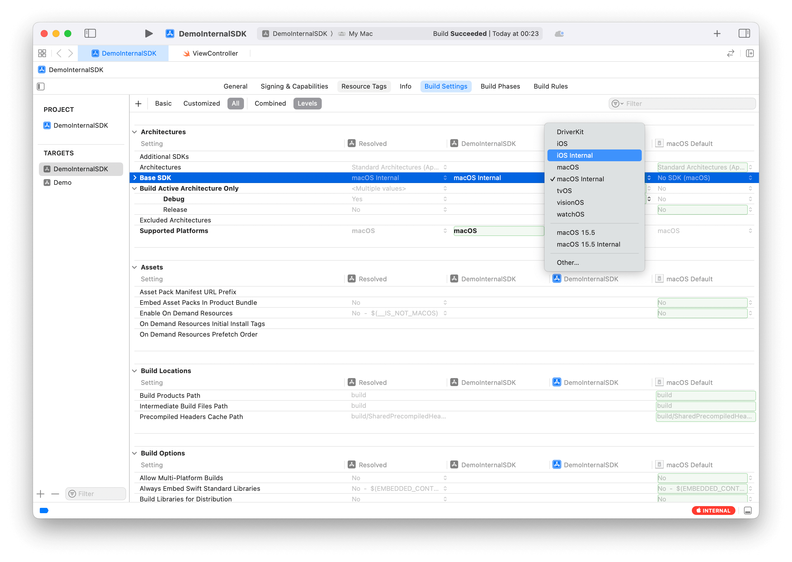
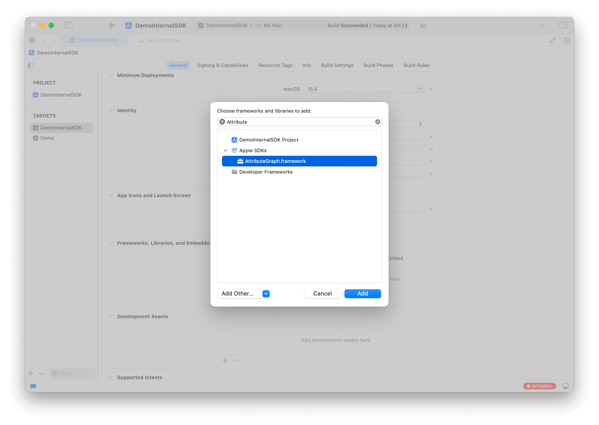
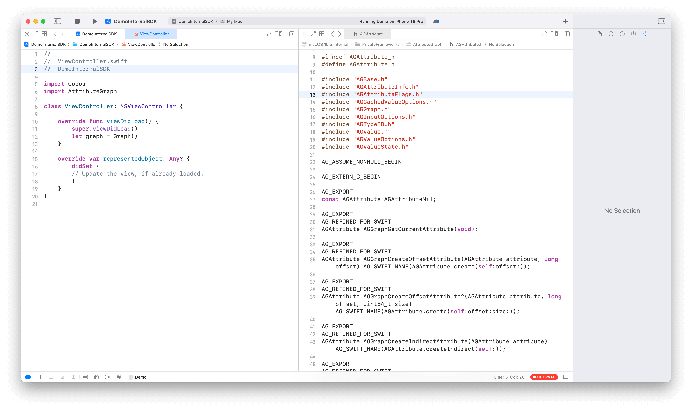

# DarwinPrivateFrameworks

This project contains private frameworks for Darwin platforms, including `AttributeGraph`, `RenderBox` and `CoreUI`.

The frameworks are provided as xcframeworks available for macOS, iOS Simulator, and iOS[^1] platform.

> [!CAUTION]
> These private frameworks are **ONLY** for research and educational purposes.
>
> **DO NOT** use them in App Store submissions or ship them to production/release environments.
>
> Using private frameworks in App Store apps will result in rejection and will crash your app in future OS update.

> [!WARNING]
> The scripts and xcframework code have only been tested on **macOS 15.5 and iOS 18.5**. Other system versions are not guaranteed to work.
>
> Please resolve any compatibility issues yourself. Contributions are welcome!

## Structure

- `AG/`: Contains the `AttributeGraph` framework.
- `CoreUI/`: Contains the `CoreUI` framework.
- `Examples/`: Contains example projects demonstrating usage of the private frameworks.
- `RB/`: Contains the `RenderBox` framework.
- `Plugins/UpdateModule/`: Contains the `UpdateModule` plugin for updating the frameworks.

## Update

After editing the sources, you need to update the xcframeworks to reflect the changes.

To update the xcframework, run the following commands:

```shell
swift package update-xcframeworks
```

## Usage

There are three ways supported to integrate and use these private frameworks:

### 1. For Swift Package Manager Projects

For Swift Package Manager projects, add the dependency as a normal package dependency in your `Package.swift` file:

```swift
dependencies: [
    .package(url: "https://github.com/OpenSwiftUIProject/DarwinPrivateFrameworks.git", from: "0.0.2"),
]
```

Then import and use the frameworks directly in your Swift code.

### 2. For Xcode Project

For Xcode projects, first add the dependency as above and then manually drag the corresponding xcframework into your project:

1. Locate the xcframework (e.g., `AG/2024/AttributeGraph.xcframework`)
2. Drag it into your Xcode project's target Frameworks section

> Alternatively, you could copy the corresponding AG binary directly into the framework directory of this repository to avoid manully xcframework adding.
>
> However, for maintainability and file size considerations, this approach is not currently used.
>
> In the future, once the project is stable, we may consider publishing a complete xcframework on GitHub for direct dependency.

### 3. Globally use via Internal SDK

1. Use the following installation script to set up an internal SDK to use these private frameworks[^2] globally:

```shell
Scripts/install_private_sdk.sh MacOSX
```

2. Choose the corresponding Internal SDK as the Base SDK in your Xcode project settings.



3. in your target's General tab, add the corresponding private framework shown in Apple SDKs part to the "Frameworks, Libraries, and Embedded Content" section.



4. In your Swift code, import the frameworks as needed:

```swift
import AttributeGraph
```



[^1]: The Swift API of AttributeGraph is not available on iOS platform.

[^2]: Only AttributeGraph is currently installed to the Internal SDK. Other frameworks are not ready yet.
